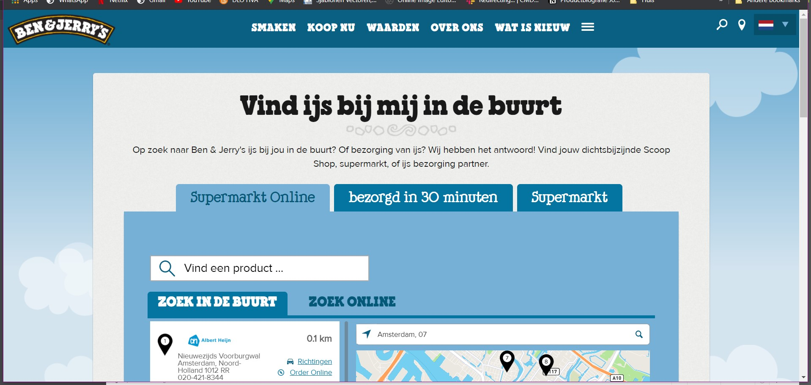

# Procesverslag
**Auteur:** -Josette Derksen-

Markdown cheat cheet: [Hulp bij het schrijven van Markdown](https://github.com/adam-p/markdown-here/wiki/Markdown-Cheatsheet). Nb. de standaardstructuur en de spartaanse opmaak zijn helemaal prima. Het gaat om de inhoud van je procesverslag. Besteedt de tijd voor pracht en praal aan je website.

## Bronnenlijst
1. -bron 1-
2. -bron 2-
3. -...-

## Eindgesprek (week 7/8)

-Ik vond het lastig om te starten wat duidelijk te zien is in het resultaat tot nu toe. Ik het er veel te weinig tijd in gestoken en niet om hulp gevraagd. Wat goed ging is dat ik de voortgangsgesprekken heb gevolgd en ik wel weet dat ik meer tijd erin moet steken alleen nu moet ik het nog doen.-

**Screenshot(s):**
-screenshot(s) van je eindresultaat-

## Voortgang 3 (week 6)

-Eindelijk iets verder gekomen, maar nog steeds erg traag en aan het uitstellen, omdat ik tegen de code opzie en dit als laatste van al mijn vakken steeds ga doen. Ik frustreer mezelf erg als iets niet snel lukt en dat is erg het geval met code. Daarnaast loop ik met meerdere vakken achter omdat ik moeite heb motivatie en energie te vinden om met alles te beginnen, misschien komt het door Corona of het weer, maar ik heb moeite met opgang komen en ook het dan vast te houden.-

**Screenshot(s):**

### Verslag van meeting

## Voortgang 2 (week 5)

### Stand van zaken

- Traag op gang gekomen. Nog bijna nergens.-

### Verslag van meeting

- Heel erg hetzelfde als voortgang 1, alleen hadden we nu een student-assistent die ging kijken naar ons werk.
Ik was nog niet veel verder gekomen behalve wat tekst en wat kleurtjes erin te zetten.

Volgens de student-assistent kan ik het nog inhalen als ik nu begin. Volgens haar was het handig om eerst alle concent op webstite te zetten en deze dan te gaan beperken in CSS. 

## Voortgang 1 (week 3)

### Stand van zaken

-Ik vind het erg lastig om te beginnen met de website maken en de opdrachten maken, ik vind het lastig om met code te beginnen.-

**Screenshot(s):**

-screenshot(s) van hoe ver je bent-

### Agenda voor meeting

-samen met je groepje opstellen-

### Verslag van meeting

-We hedden besproken dat ik het nog in kan halen als ik nu begin.-

## Intake (week 1)

**Je startniveau:** -kies uit zwart, rood óf blauw-

Mijn startniveau ligt denk ik rond de blauwe piste hoewel ik met wat meer oefening de rode piste na een tijdje ook zou kunnen gaan betreden.

**Je focus:** -kies uit responsive óf surface plane-

Ik denk dat mijn focus komt te liggen op de surface plane omdat mijn code nog niet erg goed is en ik producten responsive maken nog erg lastig vind. 

**Je opdracht:** -link naar de website die je gaat namaken óf de naam van je eigen ontwerp-

De website die ik wil gaan realiseren is van: https://www.benjerry.nl/

**Screenshot(s):**

**Breakdown-schets(en):**

